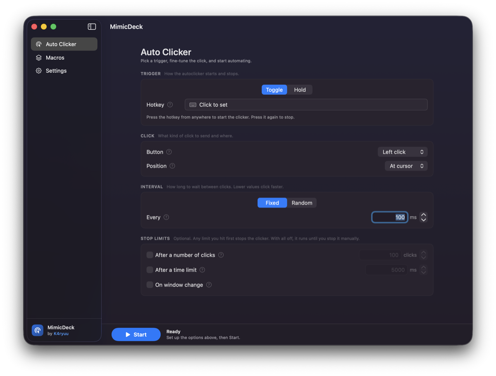
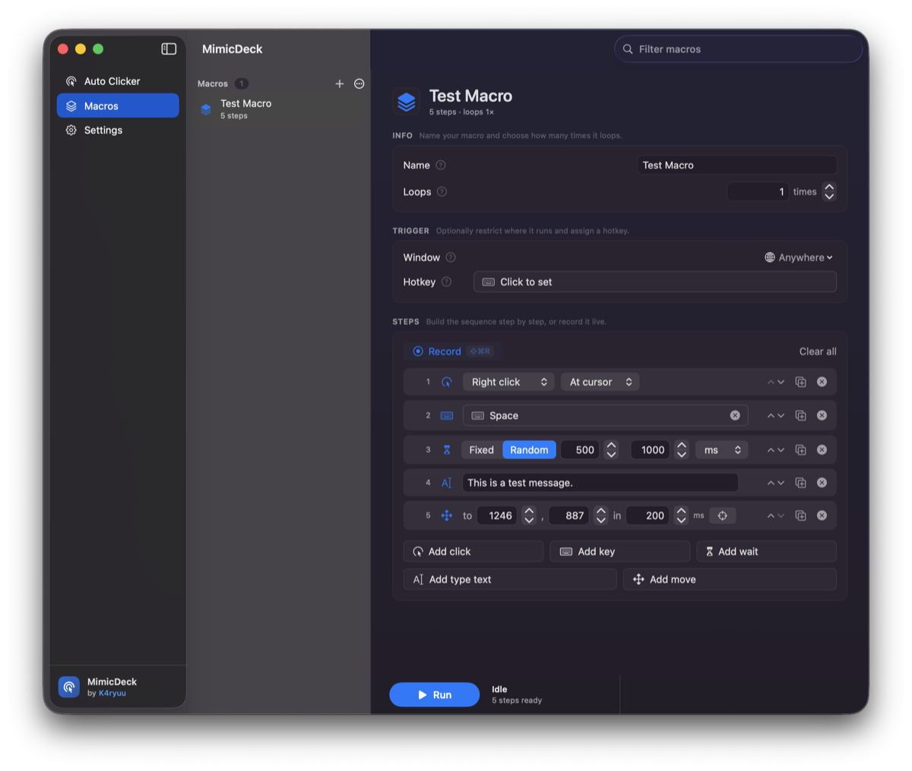
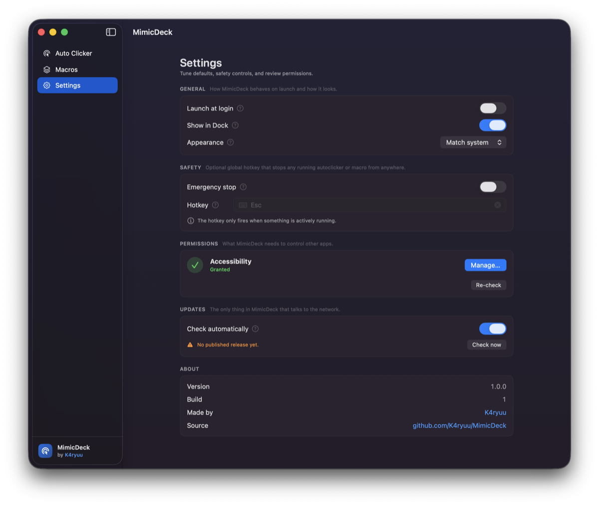
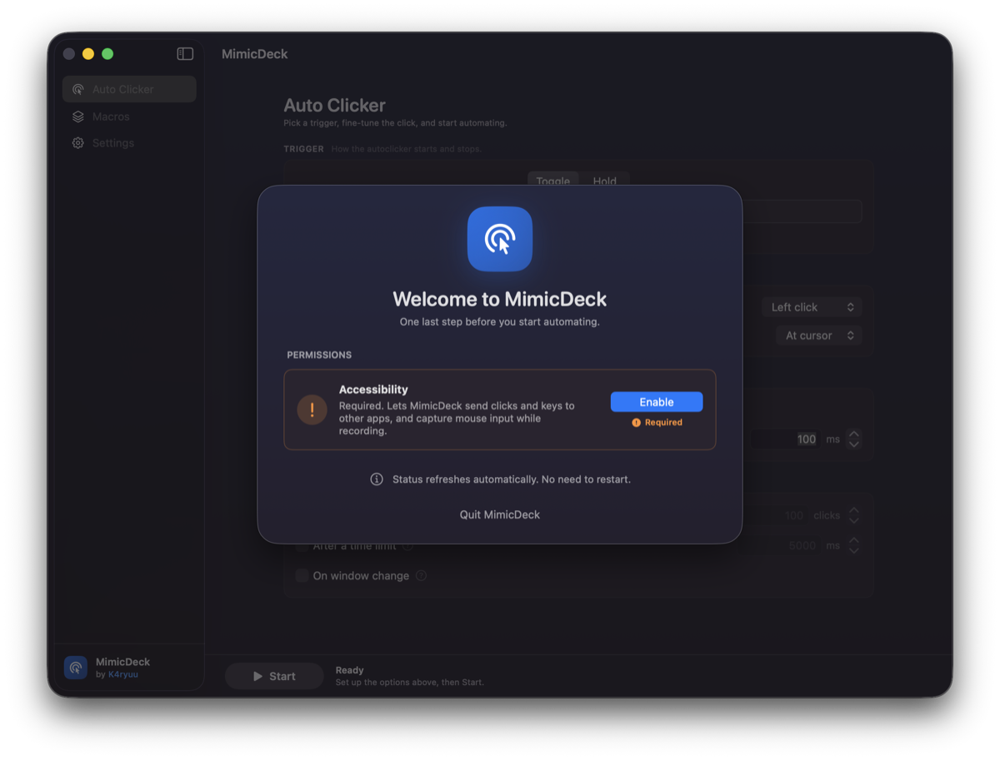

# MimicDeck

A native macOS autoclicker and macro tool. SwiftUI front end, `CGEvent` under
the hood, no Electron, no browser, no telemetry.

Two things live in one app:

- **Auto Clicker.** A click loop you configure and fire with a global hotkey.
  Fixed or random interval, at the cursor or at a pinned screen point, with
  optional stop limits.
- **Macros.** Recorded or hand-built step lists (clicks, key combos, typed
  text, waits, cursor moves) that replay with their original timing, loop as
  many times as you want, and can be bound to a specific app.

Requires macOS 14 (Sonoma) or newer. Universal binary, Apple Silicon and
Intel.



<table>
<tr>
<td width="50%"></td>
<td width="50%"></td>
</tr>
<tr>
<td align="center"><em>Record or hand-build a macro, step by step</em></td>
<td align="center"><em>Safety hotkey, permissions, updates</em></td>
</tr>
</table>

## Install

**1. Download** the latest `MimicDeck-x.y.z.dmg` from
[Releases](../../releases).

**2. Open the DMG and drag MimicDeck into your Applications folder.**

**3. First launch: right-click the app and choose Open.**

> This step is not optional. MimicDeck is not signed with a paid Apple
> Developer certificate, so a plain double click gets you
> _"MimicDeck is damaged and can't be opened"_ or _"cannot be opened because
> the developer cannot be verified"_. Neither is true, it is just Gatekeeper
> refusing anything unsigned it found on the internet.
>
> **Right-click (or Control-click) the app icon, choose Open, then confirm
> Open in the dialog.** You only do this once. From then on it launches
> normally.
>
> If macOS still refuses, clear the download quarantine flag by hand:
>
> ```bash
> xattr -dr com.apple.quarantine /Applications/MimicDeck.app
> ```

**4. Grant Accessibility.** MimicDeck opens a setup sheet asking for it, walks
you to the right pane in System Settings, and notices the moment you flip the
switch, so no restart is needed. Details in [Permissions](#permissions) below.

<p align="center">
  
</p>

**Upgrading from an older build?** macOS ties permissions to the exact app
signature, so the old entry in System Settings goes stale and does nothing.
Select the old MimicDeck row in **Privacy & Security → Accessibility**, press
the minus button to remove it, then let the app add itself again.

### Building it yourself instead

```bash
git clone https://github.com/K4ryuu/MimicDeck.git
cd MimicDeck
xcodebuild -scheme MimicDeck -destination 'platform=macOS' build
```

Or open `MimicDeck.xcodeproj` in Xcode 16+ and hit Run. The project ships with
no development team set, so Xcode signs it to run locally. A build you make
yourself never hits the Gatekeeper prompt above.

## Features

|                 |                                                                                                                                          |
| --------------- | ---------------------------------------------------------------------------------------------------------------------------------------- |
| Click loop      | Left / right / middle, fixed or random interval, at cursor or fixed point                                                                |
| Trigger modes   | **Toggle** (press to start, press to stop) or **Hold** (clicks while held)                                                               |
| Stop limits     | After N clicks, after a time limit, or when the frontmost app changes. Mix freely, first one wins                                        |
| Macro recorder  | Captures clicks and keystrokes with real timing. Consecutive typing merges into one readable "type text" step                            |
| Macro editor    | Reorder, edit and delete steps inline. Add clicks, keys, waits, typed text and cursor moves by hand                                      |
| Window binding  | Bind a macro to an app. It pauses automatically whenever that app is not frontmost, and resumes when it is                               |
| Global hotkeys  | Per-macro and per-clicker key combos that work from any app                                                                              |
| Emergency stop  | Opt-in global panic key that stops anything running, from anywhere                                                                       |
| Import / export | Share macros as `.mimicdeck` JSON bundles                                                                                                |
| Menu bar mode   | Hide the Dock icon and run from a status item instead                                                                                    |
| Update check    | Optional daily check against GitHub releases. Opens the download page, never downloads or installs anything, and switches off completely |

## Permissions

macOS gates synthetic input behind a privacy prompt. MimicDeck asks on first
launch and shows the live status in Settings.

| Permission        | Needed for                                                                       | Required?                     |
| ----------------- | -------------------------------------------------------------------------------- | ----------------------------- |
| **Accessibility** | Sending clicks and key presses to other apps, and capturing them while recording | Yes. Nothing works without it |

It lives in **System Settings → Privacy & Security → Accessibility**. The app
detects the moment you flip the switch, so there is no need to restart it.

macOS also has a separate **Input Monitoring** bucket for reading keystrokes.
In practice Accessibility already covers it, and its preflight check reports
"denied" even on machines where recording works, so MimicDeck does not ask for
it. If recording genuinely fails, the recorder says so instead of guessing.

The app is deliberately **not sandboxed**: the App Store sandbox makes
cross-app event injection impossible, which is the entire point of the tool.

## Where your data lives

Everything is local. No account, no analytics, no telemetry.

The one exception is the update check, which asks the GitHub releases API once
a day whether a newer version exists. It sends nothing about you, downloads
nothing, installs nothing, and the most it ever does is open the releases page
in your browser. Turn it off in **Settings → Updates** and the app makes no
network requests at all.

| What                                 | Where                                                            |
| ------------------------------------ | ---------------------------------------------------------------- |
| Macros                               | `~/Library/Application Support/KitsuneLab/MimicDeck/macros.json` |
| Clicker config, preferences, hotkeys | `defaults` domain `KitsuneLab.MimicDeck`                         |

## Responsible use

Automated input is against the rules of most online games and many web
services, and using it can get your account banned. This tool exists for
repetitive local work: UI testing, grinding through a form, single-player
games, accessibility. What you point it at is on you.

An imported `.mimicdeck` file can contain any sequence of clicks and
keystrokes, and those go to whatever app is focused when you run it. The
importer tells you what is in a file before it lands in your library, and
warns you when the macro types rather than only clicks. Treat one from a
stranger like a shell script from a stranger: read it first.

## Development

```bash
# build
xcodebuild -scheme MimicDeck -destination 'platform=macOS' build

# unit tests (Swift Testing)
xcodebuild -scheme MimicDeck -destination 'platform=macOS' \
  -only-testing:MimicDeckTests test
```

Swift 6 language mode, strict concurrency on, `MainActor` by default.

Layout:

```
MimicDeck/
  App/          entry point, NSApplicationDelegate bridge
  Models/       Macro, MacroStep, Hotkey, AutoClickerConfig, WindowFilter
  Services/     event injection, recorder, engine, hotkeys, persistence
  Utilities/    permissions, key names, screen geometry
  Views/        SwiftUI screens and components
MimicDeckTests/   Swift Testing suites
```

State that outlives a view (the click loop, global hotkeys, the macro
engine) lives in a service under `Services/`, never in `@State`. Views get
torn down on navigation; a running clicker must not go with them.

Release history lives in [CHANGELOG.md](CHANGELOG.md).

Cutting a release is one command. It reads the version from
`Config/Version.xcconfig`, builds the installer, lifts that version's section
out of the changelog for the release notes, tags and uploads. It refuses to
run if the tag or the release already exists.

```bash
./scripts/publish-release.sh
```

## License

MIT. See [LICENSE](LICENSE).
